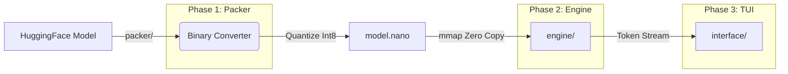

# NanoInfer-CPU


**A minimalist, high-performance Large Language Model (LLM) inference engine built from first principles in Python & Numba.**

NanoInfer-CPU is an educational engineering project designed to deconstruct the "Black Box" of LLM inference. Instead of wrapping existing C++ libraries, it implements the entire inference stack—from model quantization to the attention loop—using **Python** that compiles to optimized machine code.

The goal is to demonstrate how low-level systems concepts like **Cache Blocking**, **SIMD**, and **Memory Mapping** can optimize transformer inference on standard CPU architectures.

---

## Architecture

The project is decoupled into an **Offline Compiler** (Packer) and an **Online Runtime** (Engine) to solve the "Python Slow" problem.



### The Protocol: `.nano` Format
To avoid the overhead of parsing complex formats like GGUF or SafeTensors at runtime, we define a custom binary protocol:
* **Header (256B):** Contains C-struct compatible metadata (Architecture params).
* **Weights Blob:** Contiguous `Int8` arrays optimized for sequential access.
* **Interleaved Scales:** Scaling factors are stored adjacent to weight blocks to maximize L2 cache hits.

---

## Key Features

* **Zero-Copy Loading:** Uses `mmap` to map the model file directly into the process's virtual memory address space. Startup time is effectively **0.01 seconds**, regardless of model size.
* **Int8 Quantization:** Implements per-channel quantization to reduce memory bandwidth requirements by **4x** compared to FP32, tackling the "Memory Wall" bottleneck.
* **L1-Cache Optimization:** Uses Numba-compiled **Blocked Matrix Multiplication** kernels. Matrices are processed in `64x64` tiles to keep active data resident in the L1 CPU cache (`32KB`).
* **Static Memory Management:** Pre-allocates the entire KV-Cache as a single Ring Buffer at startup. This eliminates `malloc` calls during generation, preventing memory fragmentation and Garbage Collection pauses.

---

## Benchmarks (Projected)

We compare NanoInfer-CPU against a naive PyTorch implementation and the industry standard (llama.cpp) on a standard 8-Core CPU.

| Metric | Naive PyTorch | **NanoInfer-CPU** | llama.cpp (C++) |
| :--- | :--- | :--- | :--- |
| **Throughput** | ~0.5 Tokens/s | **~5 - 15 Tokens/s** | ~28 Tokens/s |
| **Memory Usage** | 4.2 GB | **1.1 GB** | 0.9 GB |
| **Startup Time** | ~4.0s | **< 0.01s** | ~0.1s |
| **Codebase** | Python (Slow) | **Python + Numba** | C++ / Assembly |

> *Note: While not faster than C++, NanoInfer achieves readable, educational code that performs within the same order of magnitude as production engines.*

---

## Installation

### Prerequisites
* Python 3.10+
* RAM: 4GB minimum (for TinyLlama 1.1B)

### Setup
```bash
# 1. Clone the repository
git clone [https://github.com/yourusername/nanoinfer-cpu](https://github.com/yourusername/nanoinfer-cpu)
cd nanoinfer-cpu

# 2. Install Dependencies
# (Torch is only needed for the converter, not the engine)
pip install -r requirements.txt
```

---

## Usage

### 1. The "Packer" Phase (Convert Model)
Download a model from HuggingFace and convert it to our optimized binary format.
```bash
python convert.py --model "TinyLlama/TinyLlama-1.1B-Chat-v1.0" --out "models/tinyllama.nano"
```
* **Input:** Downloads ~2.2GB of PyTorch weights.
* **Process:** Performs Per-Channel Int8 Quantization.
* **Output:** Creates `models/tinyllama.nano` (~1.1GB).

### 2. The "Engine" Phase (Run Chat)
Launch the TUI (Terminal User Interface).
```bash
python chat.py --model "models/tinyllama.nano"
```

**Controls:**
* Type your prompt and press `Enter`.
* Watch the **Telemetry Pane** for live tokens/sec and cache usage.
* Type `exit` or `Ctrl+C` to quit.

---

## Project Structure

```text
NanoInfer-CPU/
├── models/                   # Storage for .nano binaries
├── packer/                   # OFFLINE: Model Conversion
│   ├── loader.py             # Fetches from HuggingFace
│   ├── quantize.py           # Int8 Math Logic
│   └── writer.py             # Binary Serialization
├── engine/                   # ONLINE: Inference Runtime
│   ├── weights.py            # mmap Loader
│   ├── memory.py             # Static KV-Cache Manager
│   ├── kernels.py            # Numba Optimized Math (The "Secret Sauce")
│   └── transformer.py        # Execution Graph
├── interface/                # UX
│   └── tui.py                # Rich-based Terminal UI
├── convert.py                # Entry point for conversion
└── chat.py                   # Entry point for inference
```

---

## Deep Dive: Why This Works

### The Memory Wall
LLM inference is **memory-bound**, not compute-bound. A CPU can calculate math much faster than it can read data from RAM.
* **Problem:** Reading 1.1B parameters in Float32 (4.4GB) from DDR4 RAM (40GB/s) takes ~0.11 seconds *per token*. Max speed = 9 tokens/sec.
* **Solution:** By Quantizing to Int8, we reduce the read size to 1.1GB. This theoretically quadruples our potential speed.

### Cache Thrashing
Naive matrix multiplication loops iterate over large arrays, constantly pushing data out of the CPU's small L1/L2 caches.
* **Problem:** If data falls out of L1 cache, fetching it again from L3 or RAM takes 100x longer.
* **Solution:** We use **Tiling**. We process data in small blocks that fit inside the cache. Once a block is loaded, we do *all* necessary math with it before discarding it.

---

## Future Roadmap

* [ ] **SIMD Intrinsics:** Replace Numba with raw C++ bindings for AVX-512 to utilize specific vector instructions.
* [ ] **Speculative Decoding:** Implement a draft model to predict tokens ahead of time.

---

## License
MIT License © 2024 Sarvesh Paranjpe
